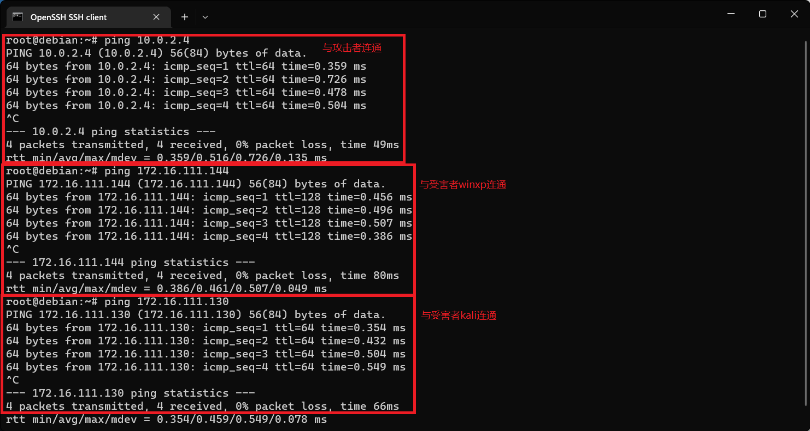

# 基于 VirtualBox 的网络攻防基础环境搭建

## 实验目的

- 掌握 VirtualBox 虚拟机的安装与使用；
- 掌握 VirtualBox 的虚拟网络类型和按需配置；
- 掌握 VirtualBox 的虚拟硬盘多重加载；

## 实验环境

以下是本次实验需要使用的网络节点说明和主要软件举例：

- VirtualBox 虚拟机
- 攻击者主机（Attacker）：Kali
- 网关（Gateway, GW）：Debian
- 靶机（Victim）：xp-sp3 

## 实验要求

* 虚拟硬盘配置成多重加载，效果如下图所示；

  

* 搭建满足如下拓扑图所示的虚拟机网络拓扑；

  

> 根据实验宿主机的性能条件，可以适度精简靶机数量 

* 完成以下网络连通性测试； 
  - [x] 靶机可以直接访问攻击者主机 
  - [x] 攻击者主机无法直接访问靶机 
  - [x] 网关可以直接访问攻击者主机和靶机 
  - [x] 靶机的所有对外上下行流量必须经过网关 
  - [x] 所有节点均可以访问互联网 

## 实验过程

1. 配置虚拟硬盘多重加载

   在VirtualBox管理>虚拟介质管理中，将硬盘类型修改为多重加载即可。

   

2. 搭建虚拟机网络拓朴

   配置网关，网管需要四块网卡

   * NAT网络，使虚拟机可以访问`internet`。
   * 仅主机（Host-Only）网络，使主机可以通过`SSH`服务访问虚拟机。
   * 内部网络intnet1，搭建局域网1。
   * 内部网络intnet2，搭建局域网2。

   

   配置攻击者网卡

   * NAT网络，使虚拟机可以访问`internet`。

   

   配置受害者网卡

   * 内部网络，不同局域网设置不同的网卡即可。比如`winxp(vivtim)`属于`intnet1`网络段，即将其网卡设置为`intnet1`即可。其他的主机类似。

   

   

3. 网络连通性测试 （为了实验报告的简洁，在实验报告中仅展示局域网`intnet1`中的主机）

   |     主机      |     IP地址     |
   | :-----------: | :------------: |
   |  attack-kali  |    10.0.2.4    |
   | victim-winxp1 | 172.16.111.144 |
   |  victim-kali  | 172.16.111.130 |

   1. 靶机可以直接访问攻击者主机

       分别使用`victim-winxp1`和`victim-kali`ping`attack-kali`，结果如下：

       

       

       因为网关使用了NAT网络模式，攻击者也使用了NAT网络模式，所以这两个主机相当于在同一个网络中，可以互相访问，因此网关所连接的局域网也都可以访问。这里使用Virtualbox官网的一张图来解释。

       

   2. 攻击者主机无法直接访问靶机 

       

       因为这两台主机都是处在内部局域网中，其ip地址也都为私有地址，所以攻击者无法连通。

   3. 网关可以直接访问攻击者主机和靶机

       

   4. 靶机的所有对外上下行流量必须经过网关

       靶机想要访问互联网必须要通过网关进行转发流量，那么只需在靶机上网时对网关抓包即可。

       ```shell
       tcpdump -i enp0s9 -n -w 20220917.pcap
       ```

       

       [20220917.pcap](20220917.pcap)

   5. 所有节点均可以访问互联网 

       

       

       

       

       上图表示所有主机均可以访问互联网。

## 参考文献

[VirtualBox Network Settings: Complete Guide](https://www.nakivo.com/blog/virtualbox-network-setting-guide/) 

[实验 · 网络安全 (c4pr1c3.github.io)](https://c4pr1c3.github.io/cuc-ns/chap0x01/exp.html) 

