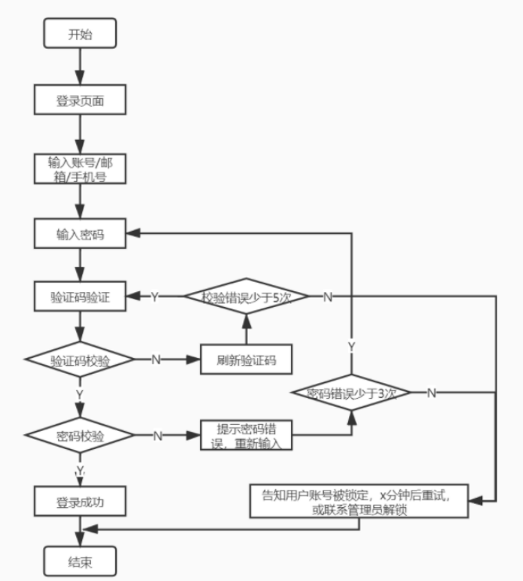
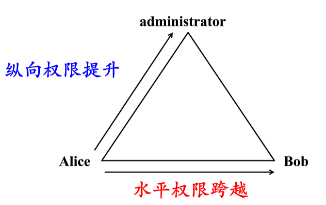
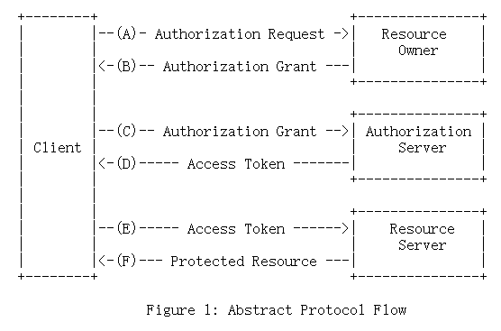
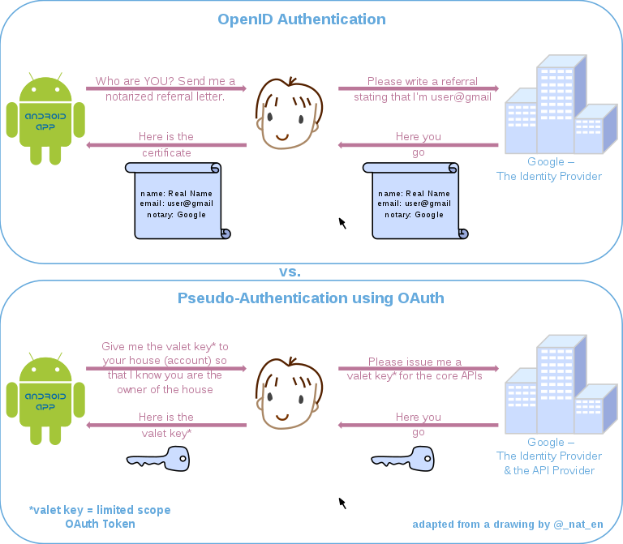

#  操作系统的访问控制设计实例

## 实验目的

* 以 iOS 和 Android 系统为研究对象，对操作系统的访问控制进行研究。

## 实验环境

* 操作系统：iOS 16.0.2
* 硬件版本：iPhone 13pro

## 实验结果

* 以 iOS 和 Android 系统为研究对象

  * 当系统处于锁屏状态下接收到新短信时，不解锁情况下

    * 系统是否允许查看短信内容？**不允许**
    * 系统是否允许回复短信？**不允许**

  * 当系统处于锁屏状态下，使用系统内置（例如 iOS 的 Siri ）或第三方的语音助手可以完成以下哪些操作？

    * 访问通讯录

      **不允许**

    * 拨打电话

      **允许**

    * 访问相册

      **不允许**

    * 查看短信收件箱

      **不允许**

思考题

* 以上设计实现方式属于我们课堂上讲过的哪种强制访问控制模型？Lattice/BLP？Biba？
  * Biba模型-上读下写
* 系统或第三方应用程序是否提供了上述功能的访问控制规则修改？如果修改默认配置，是提高了安全性还是降低了安全性？
  * 是，总体来说，授予的权力越多就越不安全

# 课后题

1. 生物特征身份认证方式有哪些？优缺点分析？应用场景举例。

   * 指纹识别

     * 优点

       1. **独特性**。19世纪末，英国学者亨利提出了基于指纹特征进行认证的原理和方法。根据亨利的理论，一般人的指纹在出生后的9个月便成形，并终生不会改变；每一个指纹都有70~90个基本特征点。另外，据最近的一项统计，在全世界60多亿人口中，没有两个人的指纹是完全相同的。
       2. **稳定性。**指纹纹脊的样式终端不变。指纹不会随着人的年龄、健康程序的变化而发生变化。
       3. **方便性。**目前已建有标准化的指纹样本库，以方便指纹认证系统的开发。同时，在指纹识别系统中用于指纹采集的硬件设备也较容易实现。
     * 缺点
       1. 对环境的要求很高，对手指的湿度、清洁度等都很敏感，脏、油、水都会造成**识别**不了或影响到**识别**的结果；
       2. 某些人或某些群体的**指纹**特征少，甚至无**指纹**，所以难以成像；
       3. 对于脱皮、有伤痕等低质量**指纹**存在**识别**困难、**识别**率低的问题，对于一些手上老茧较多的体力劳动者等部分特殊人群的注册和**识别**困难较大；
       4. 指纹可能被复制，伪装从而导致安全性大大降低
     * 应用场景
       1. 用于入境检查、验证身份：指纹被广泛应用于生活出行，用来鉴别身份就是因为每个人指纹的纹路都不一样，每个人都与众不同，即使是双胞胎在纹型上有高度的相似性，可其细节特征并不完全相同，而是存在一定的差异。
       2. 应用于科技领域的指纹解锁：很多商家也都利用指纹的特性，研制出一些高科技的设备，来体现指纹给生活带来的方便和安全，比如指纹锁，指纹门禁，指纹考勤机，指纹采集仪，指纹保险柜以及网络指纹登陆技术等等。
       3. 医学用途：随着科学技术的发展，指纹在医学上又有了新的用途。有的医生发现，通过检查人的指纹、掌纹，能够查出某些疾病。
   * 静脉识别

     * 优点

       1. 属于内生理特征，不会磨损，较难伪造，具有很高安全性。
       2. 血管特征通常更明显，容易辨识，抗干扰性好。
       3. 可实现非接触式测量，卫生性好，易于为用户接受。
       4. 不易受手表面伤痕或油污的影响。
       5. 静脉识别系统安全等级高，特别适合于安全要求高的场所使用。
     * 缺点
       1. 手背静脉仍可能随着年龄和生理的变化而发生变化，永久性尚未得到证实。虽然可能性较小，但仍然存在无法成功注册登记的可能。
       2. 由于采集方式受自身特点的限制，产品难以小型化。
       3. 采集设备有特殊要求，设计相对复杂，制造成本高。
     * 应用场景
       1. 实时采取静脉图，提取特征值进行匹配，从而对个人进行身份鉴定。
   * 虹膜识别

     * 优点

       1. 方便快捷：虹膜是身体自身的功能器官，不会像钥匙、密码那样容易忘记和丢失。
       2. 无法复制：不同于指纹和面部容易被磨损和复制，虹膜在眼睛内部，几乎没有被复制的可能。
       3. 非接触性：使用虹膜识别不需要和设备直接接触就可以获取图像，干净卫生，避免了疾病的接触传染。
     * 缺点
       1. 很难将图像获取设备的尺寸小型化；
       2. 设备造价高，无法大范围推广；
       3. 镜头可能产生图像畸变而使可靠性降低；
       4. 一个自动虹膜识别系统包含硬件和软件两大模块：虹膜图像获取装置和虹膜识别算法。分别对应于图像获取和模式匹配这两个基本问题。
     * 应用场景
       1. 门禁考勤：扫描虹膜就能实现通道控制、开/锁门的和考勤管理，虹膜考勤识别迅速，无需接触，不能被假冒和替代打卡。
       2. 网络安全：借助虹膜技术提供互联网保护，确保用户登陆、计算机、在线交易及信息安全，如微软的Windows10用虹膜识别代替密码登录。
       3. **银行高端系统-金库安保**，聚虹光电的虹膜金库门禁，已经在**中国人民银行的两个金库**上线使用，该产品通过公安部警用装备检测中心的检测，通过GB与GA双标准认证，防打印攻击与视频攻击，配合虹膜云服务管理系统，可根据业务流程灵活配置、调整用户权限，实现管理端对所有网点端联网集中管控，是安全等级极高的金库门禁系统。 聚虹开发的虹膜+人脸二合一门禁，作为VIP客户室的门禁，已经在**中国建设银行全球首家无人银行上线。**
   * 视网膜识别
     * 优点
       1. 视网膜是一种极其固定的生物特征，不磨损、不老化、不受疾病影响；使用者无需和设备直接接触；是一个最难欺骗的系统，因为视网膜不可见，所以不会被伪造。
     * 缺点
       1. 未经测试；激光照射眼球的背面可能会影响使用者健康，这需要进一步的研究；对消费者而言，视网膜技术没有吸引力；很难进一步降低成本。
   * 面部识别
     * 优点
       1. 人脸识别技术具有较高的准确率，人脸识别是通过对人的人脸特征进行计算，然后将人脸与样本库中的样本进行比较，得到准确的识别结果。
       2. 人脸识别是非接触性识别，他不需要与设备直接接触，就可以获取人脸图像特征。
       3. 一种多人同时进行一类识别，一定范围内的人脸特征可以同时识别。
       4. 速度快，相对于指纹采集和声音采集，识别速度更快。
     * 缺点
       1. 相似性不同个体之间的区别不大，所有的面部的结构都相似，甚至面部器官的结构外形都很相似。
       2. 易变性面部的外形很不稳定，人可以通过脸部的变化产生很多表情，而在不同观察角度，面部的视觉图像也相差很大
       3. 面部识别还受光照条件（例如白天和夜晚，室内和室外等）、面部的很多遮盖物（例如口罩、墨镜、头发、胡须等）、年龄等多方面因素的影响。
     * 应用场景
       1. 企业考勤管理，现在很多企业都采用刷脸打卡，其实就是人脸识别。
       2. 小区门禁和家庭防盗方面也比较采用人脸识别技术，通过刷脸进小区，进自己家。
       3. 将人脸识别技术应用到银行自助服务系统中也越来越多。现在，从ATM取款，或者是办理银行卡时，都已使用了人脸识别技术。
       4. 在网络信息方面也应用了很多人脸识别技术，例如许多支付软件也支持人脸识别。
       5. 在交通运输和刑侦工作中使用较多的人脸识别技术，可通过人脸识别技术进行全国追捕。

2. “找回口令功能”和“忘记密码”在访问授权机制中的意义？请尝试设计几种安全的“找回口令功能”，详细描述找回口令的用户具体操作过程。

   * 意义
     - 增加了系统的可用性，若无此功能则用户忘记登陆口令就代表着该账户下存储的数据在客户端永久丢失、在服务提供商端永久不能访问
   * 找回口令功能设计
     1. 验证账户是否为本网站或应用有效账户，还要加图形码验证，防止机器人。（PS：有的网站和应用可能直接使用用户手机号或邮箱作为账户，可直接跳过此步骤）
     2. 使用账户绑定的手机号或邮箱验证，接收手机短信验证码或重置密码链接。使用手机号或邮箱主要是为了保证是用户本人操作。
     3. 输入手机短信验证码进行验证，然后录入新密码两次。或者通过邮箱重置密码链接，直接跳转到录入新密码界面，重置密码。
     4. 密码合法校验，两次密码输入相同校验。错误提示。
     5. 新密码设置成功，提示用户成功信息，结束。

3. 绘制用户使用用户名/口令+图片验证码方式录系统的流程图。考虑认证成功和失败两种场景，考虑授权成功和失败两种场景。

   

4. Windows XP / 7 中的访问控制策略有哪些？访问控制机制有哪些？

   * DAC（Discretionary Access Control，自主访问控制）DAC 就是让客体的所有者来定义访问控制规则。在 DAC 中，访问控制的规则维护完全下发到了所有者手上，管理员在理论上不需要对访问控制规则进行维护。因此，**DAC 具备很高的灵活性，维护成本也很低**。相对地，尽管 DAC 降低了管理员的工作难度，但是会增加整体访问控制监管的难度，以至于安全性完全取决于所有者的个人安全意识。这么说来，DAC 的特性其实就是将安全交到了用户手中，因此，DAC 适合在面向用户的时候进行使用。当用户需要掌控自己的资源时，我们通常会采取 DAC，来完成访问控制。比方说，Linux 中采用的就是 DAC，用户可以控制自己的文件能够被谁访问。
   * role-BAC（role Based Access Control，基于角色的访问控制）**role-BAC 就是将主体划分为不同的角色，然后对每个角色的权限进行定义**。**role-BAC 是防止权限泛滥，实现最小特权原则的经典解决方案**。试想一下，假如没有角色的概念，那么管理员需要给每一个用户都制定不同的权限方案。当用户的岗位或职责发生变更时，理论上管理员需要对这个用户的权限进行重新分配。但是，准确识别每一个用户需要哪些权限、不需要哪些权限，是一个很有挑战的工作。如果采用了 role-BAC，那么管理员只需要简单地将用户从一个角色转移到另一个角色，就可以完成权限的变更。因此，role-BAC 更适合在管理员集中管理的时候进行使用。在这种情况下，所有的权限都由管理员进行分配和变更，所以，使用 role-BAC 可以大大降低管理员的工作难度，提高他们的工作效率。同样的原理也适用于应用，应用可以对不同的角色限定不同的操作权限，比如：运维人员给开发、产品、运维划分不同的机器操作权限。
   * rule-BAC（rule Based Access Control，基于规则的访问控制）**rule-BAC 就是制定某种规则，将主体、请求和客体的信息结合起来进行判定**。相比较来说，DAC 是所有者对客体制定的访问控制策略，role-BAC 是管理员对主体制定的访问控制策略，而 rule-BAC 可以说是针对请求本身制定的访问控制策略。在 rule-BAC 中，有一点需要我们注意。那就是，**我们需要定义是“默认通过”还是“默认拒绝”**，即当某次请求没有命中任何一条规则时，我们是应该让它“通过”还是“拒绝”呢？这需要根据安全的需求来进行综合考量。比如，某个服务只提供了 80 和 443 端口的 Web 服务，那么防火墙配置的规则是允许这两个端口的请求通过。对于其他任何请求，因为没有命中规则，所以全部拒绝。这就是“默认拒绝”的策略。很多时候，**为了保障更高的可用性，应用会采取“默认通过”的策略**。
   * MAC（Mandatory Access Control，强制访问控制）**MAC 是一种基于安全级别标签的访问控制策略**。为了保证机密性，MAC 不允许低级别的主体读取高级别的客体、不允许高级别的主体写入低级别的客体；为了保证完整性，MAC 不允许高级别的主体读取低级别的客体，不允许低级别的主体写入高级别的客体。**MAC 是安全性最高的访问控制策略。但它对实施的要求也很高，需要对系统中的所有数据都进行标记。**

5. 用权限三角形模型来理解并描述下 2 种威胁模型：提权、仿冒。

   * 提权：
     * 提权分为：水平特权提升、垂直特权提升。
     * 提权是指本来没有某项权限的用户，通过一定的方法获得该权限，简而言之，用户以自己的身份获得了本不属于自己的权限。
     * 提权是用户→角色→权限，角色不变，而获取的权限扩大。
   * 仿冒
     * 仿冒是指用户A以用户B的身份通过了认证，之后行使了B所有的权利
     * 仿冒是用户→角色，获取的角色改变，所以能够行使的权限也就因角色的改变而改变了

   

6. 试通过操作系统的访问控制机制来达到预防一种真实病毒的运行目的。

   **病毒名称：**Worm_MyInfect.af

   **感染系统：**Windows 9X/ Windows ME/ Windows NT/ Windows 2000/

   Windows XP/ Windows 2003/ Windows Vista

   **病毒特性：**

   1. **生成病毒文件**病毒运行后，复制自身到下面目录：`%SysDir%\sysload3.exe`

   2. **修改注册表项**`HKCU\Software\Microsoft\Windows\CurrentVersion\Run"System Boot Check"="%SysDir%\sysload3.exe"`

   3. **感染系统中文件**它能感染本地磁盘和网络共享目录中的可执行文件和脚本文件。

   4. **下载指定网址文件**从指定网址下载木马程序和病毒升级程序

   **安全建议：**

   1. 局域网的计算机用户尽量避免创建可写的共享目录，已经创建共享目录

      的应立即停止共享。

   2. 如无必要，Windows 2000/XP用户应尽量关闭`IPC$`共享，并给具有管理员 权限的帐号设置复杂的密码。

7. 什么是 OAuth？

   一种开放协议，允许以简单和标准的方法从 Web、移动和桌面应用程序进行安全授权。

   

   OAuth在"客户端"与"服务提供商"之间，设置了一个授权层（authorization layer）。"客户端"不能直接登录"服务提供商"，只能登录授权层，以此将用户与客户端区分开来。"客户端"登录授权层所用的令牌（token），与用户的密码不同。用户可以在登录的时候，指定授权层令牌的权限范围和有效期。"客户端"登录授权层以后，"服务提供商"根据令牌的权限范围和有效期，向"客户端"开放用户储存的资料。

8. 什么是 OpenID？

   OpenID Connect 2.0是基于 OAuth 2.0 系列规范的可互操作身份验证协议。它使用简化的 REST/JSON 消息流。OpenID Connect 2.0 使开发人员能够跨网站和应用程序对用户进行身份验证，而无需拥有和管理密码文件。对于应用程序构建者，OpenID Connect 2.0 允许基于浏览器的 JavaScript 和本机移动应用程序启动登录流程并接收有关登录用户身份的可验证断言。简单来说，它是对“当前使用连接的浏览器或本机应用程序的人的身份是什么？”的响应。

9. 试用本章所学理论分析 0Auth 和 OpenID 的区别与联系。

   * OpenID只做了身份认证，没有授予权限，它实现了证明“我就是我”
   * OAuth授予第三方应用访问受保护的信息的权限

   

10. 如何使用 OAuth 和 OpenID 相关技术实现单点登录（Single Sign On）？

   **单点登录 (SSO)** 是一种对于许多相互关连，但是又是各自独立的软件系统，提供访问控制的属性。当拥有这项属性时，当用户登录时，就可以获取所有系统的访问权限，不用对每个单一系统都逐一登录。

   **微软账户就是一个单点登录微软账户**，使微软用户登录微软网站（如Outlook），运行在微软操作系统的设备（如Windows10电脑/平板、WindowsPhone、Xbox），微软应用软件（如Visual Stdio）。

   微软的网站，服务，应用程序都可以使用同一个微软账户登录，而不需要多个账户。

   也就是说，**单点登录的实现是发生在服务器之间**，如登录Outlook，用户身份的确认是由微软账户认证服务器实现，而不是Outlook服务器。
## 参考资料

[windows系统采用了那种访问控制模型_信息安全中的访问控制](https://blog.csdn.net/weixin_39638859/article/details/110464921)

[蠕虫“艾妮”情况分析和解决方案](http://wlaq.xjtu.edu.cn/info/1017/1277.htm)

[The OAuth 2.0 Authorization Framework](https://www.rfc-editor.org/rfc/rfc6749#section-1)

[简述 OAuth 2.0 的运作流程](https://www.barretlee.com/blog/2016/01/10/oauth2-introduce/)

[OpenID](https://en.wikipedia.org/wiki/OpenID)

[Single sign-on](https://en.wikipedia.org/wiki/Single_sign-on)

[What is Single Sign-On (SSO) and How Does It Work?](https://www.techtarget.com/searchsecurity/definition/single-sign-on)

