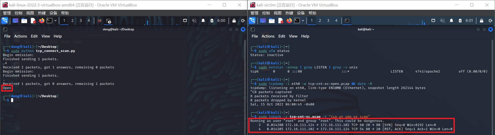
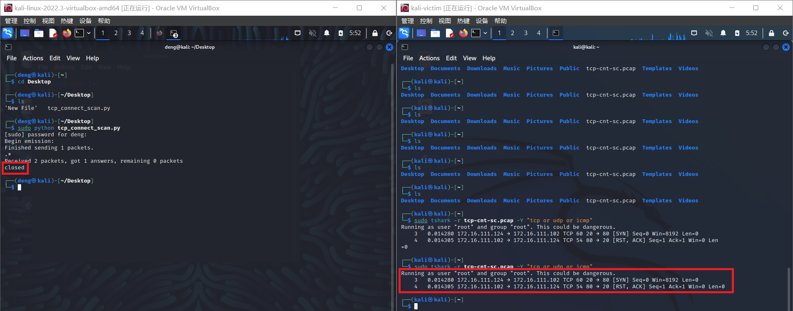

# 基于Scapy编写端口扫描器

## 实验目的

* 掌握网络扫描之端口状态探测的基本原理

## 实验环境

* `python`+`scapy`

* Linux kali 5.18.0-kali5-amd64

* 网络拓扑如下：

  

## 实验要求

* 禁止探测互联网上的 IP ，严格遵守网络安全相关法律法规
* 完成以下扫描技术的编程实现
  * TCP connect scan / TCP stealth scan
  * TCP Xmas scan / TCP fin scan / TCP null scan
  * UDP scan
* 上述每种扫描技术的实现测试均需要测试端口状态为：`开放`、`关闭` 和 `过滤` 状态时的程序执行结果
* 提供每一次扫描测试的抓包结果并分析与课本中的扫描方法原理是否相符？如果不同，试分析原因；
* 在实验报告中详细说明实验网络环境拓扑、被测试 IP 的端口状态是如何模拟的

## 实验过程

### 实验原理

> `TCP connect scan` 与 `TCP stealth scan` 都是先发送一个`S`，然后等待回应。如果有回应且标识为`RA`，说明目标端口处于关闭状态；如果有回应且标识为`SA`，说明目标端口处于开放状态。这时
>
> - `TCP connect scan`会回复一个RA，在完成三次握手的同时断开连接
> - `TCP stealth scan`只回复一个R，不完成三次握手，直接取消建立连接
>
> `TCP Xmas scan、TCP fin scan`及`TCP null scan`不涉及三次交互。它们都是先发送一个包，然后根据目标主机是否回复`R`来目标端口的状态。不同的是：
>
> - TCP Xmas scan发送的是`FPU`
> - TCP fin scan发送的是`F`
> - TCP null scan发送的包里没有设置任何flag
>
> UDP是无连接的协议，通过发送`UDP+port`得到的回复确定被扫描主机的状态。
>
> - Open：`no response / server responds to the client with a UDP packet`；
> - Closed：`ICMP error type 3 and code 3`
> - filtered：`no response / ICMP error type 3 and code 1,2,3,9,10,13`。

### 端口状态模拟

* **关闭状态**：对应端口没有开启监听，防火墙没有开启。

  ```shell
  ufw disable
  ```

* **开启状态**：对应端口开启监听。

  * `apache`基于TCP，监听在80端口
  * DNS服务基于UDP，监听在53端口

  ```shell
  systemctl start apache2 # port 80
  systemctl start dnsmasq # port 53
  ```

* **过滤状态**：对应端口开启监听，防火墙开启。

  ```she
  ufw enable && ufw deny 80/tcp
  ufw enable && ufw deny 53/udp
  ```

首先扫描一下局域网内有多少存活主机IP，使用命令

```shell
nmap -sn 172.16.111.0/24
```

> This option tells Nmap not to do a port scan after host discovery, and only print out the available hosts that responded to the host discovery probes. This is often known as a “ping scan”.


根据扫描后的结果可以知道该局域网内共有三台存活的主机，分别为网关、受害者主机和本机。

### TCP connect scan

> A client trying to connect to a server on port 80 initializes the connection by sending a TCP packet with the SYN flag set and the port to which it wants to connect (in this case port 80). If the port is open on the server and is accepting connections, it responds with a TCP packet with the SYN and ACK flags set. The connection is established by the client sending an acknowledgement ACK and RST flag in the final handshake. If this three-way handshake is completed, then the port on the server is open.
>
> The client sends the first handshake using the SYN flag and port to connect to the server in a TCP packet. If the server responds with a RST instead of a SYN-ACK, then that particular port is closed on the server.

CODE

```python
from scapy.all import *

dst_ip = "172.16.111.102"
dst_port = 80

resp = sr1(IP(dst=dst_ip)/TCP(dport=dst_port,flags="S"),timeout=10)

if resp is None:
    print("Filtered")
elif(resp.haslayer(TCP)):
    if(resp.getlayer(TCP).flags==0x12):
        send_ret = sr(IP(dst=dst_ip)/TCP(dport=dst_port,flags="AR"),timeout=10)
        print("Open")
    elif(resp.getlayer(TCP).flags==0x14):
        print("closed")
```

nmap

```shell
sudo nmap -sT -p 80 172.16.111.102
```

**端口开放**


* 使用scapy

  

* 使用nmap

  

**端口关闭**


* 使用scapy

  
  
* 使用nmap

  

**端口过滤**


* 使用scapy

  

* 使用nmap

  

### TCP stealth scan

>This technique is similar to the TCP connect scan. The client sends a TCP packet with the SYN flag set and the port number to connect to. If the port is open, the server responds with the SYN and ACK flags inside a TCP packet. But this time the client sends a RST flag in a TCP packet and not RST+ACK, which was the case in the TCP connect scan. This technique is used to avoid port scanning detection by firewalls.
>
>The closed port check is same as that of TCP connect scan. The server responds with an RST flag set inside a TCP packet to indicate that the port is closed on the server

CODE

```python
from scapy.all import *

dst_ip = "172.16.111.102"
dst_port = 80

resp = sr1(IP(dst=dst_ip)/TCP(dport=dst_port,flags="S"),timeout=10)

if resp is None:
    print("Filtered")
elif(resp.haslayer(TCP)):
    if(resp.getlayer(TCP).flags==0x12):
        send_ret = sr(IP(dst=dst_ip)/TCP(dport=dst_port,flags="R"),timeout=10)
        print("Open")
    elif(resp.getlayer(TCP).flags==0x14):
        print("closed")
    elif(resp.haslayer(ICMP)):
        if(int(resp.getlayer(ICMP).type)==3 and int(resp.getlayer(ICMP).code) in [1,2,3,9,10,13]):
            print("Filtered")
```

namp

```shel
sudo nmap -sS -p 80 172.16.111.102
```

**端口开放**


* 使用scapy

  

* 使用nmap

  

**端口关闭**


* 使用scapy

  

* 使用nmap

  

**端口过滤**


* 使用scapy

  

* 使用nmap

  

### TCP Xmas scan

> In the XMAS scan, a TCP packet with the PSH, FIN, and URG flags set, along with the port to connect to, is sent to the server.If the port is open, then there will be no response from the server.If the server responds with the RST flag set inside a TCP packet, the port is closed on the server.If the server responds with the ICMP packet with an ICMP unreachable error type 3 and ICMP code 1, 2, 3, 9, 10, or 13, then the port is filtered and it cannot be inferred from the response whether the port is open or closed.

CODE

```python
from scapy.all import *

dst_ip = "172.16.111.102"
dst_port = 80

resp = sr1(IP(dst=dst_ip)/TCP(dport=dst_port,flags="FPU"),timeout=10)

if resp is None:
    print("Open|Filtered")
elif(resp.haslayer(TCP)):
    if(resp.getlayer(TCP).flags==0x14):
        print("Closed")
    elif(resp.haslayer(ICMP)):
        if(int(resp.getlayer(ICMP).type)==3 and int(resp.getlayer(ICMP).code) in [1,2,3,9,10,13]):
            print("Filtered")
```

namp

```shell
sudo nmap -sX -p 80 172.16.111.102
```

**端口开放**


* 使用scapy

  

* 使用nmap

  

**端口关闭**


* 使用scapy

  

* 使用nmap

  

**端口过滤**


* 使用scapy

  

* 使用nmap

  

### TCP fin scan

> The FIN scan utilizes the FIN flag inside the TCP packet, along with the port number to connect to on the server. If there is no response from the server, then the port is open.
>
> If the server responds with an RST flag set in the TCP packet for the FIN scan request packet, then the port is closed on the server.
>
> An ICMP packet with ICMP type 3 and code 1, 2, 3, 9, 10, or 13 in response to the FIN scan packet from the client means that the port is filtered and the port state cannot be found.

CODE

```python
from scapy.all import *

dst_ip = "172.16.111.102"
dst_port = 80

resp = sr1(IP(dst=dst_ip)/TCP(dport=dst_port,flags="F"),timeout=10)

if resp is None:
    print("Open|Filtered")
elif(resp.haslayer(TCP)):
    if(resp.getlayer(TCP).flags==0x14):
        print("Closed")
    elif(resp.haslayer(ICMP)):
        if(int(resp.getlayer(ICMP).type)==3 and int(resp.getlayer(ICMP).code) in [1,2,3,9,10,13]):
            print("Filtered")
```

nmap

```shell
sudo nmap -sF -p 80 172.16.111.102
```

**端口开放**


* 使用scapy

  

* 使用nmap

  

**端口关闭**


* 使用scapy

  

* 使用nmap

  

**端口过滤**


* 使用scapy

  

* 使用nmap

  

### TCP null scan

>In a NULL scan, no flag is set inside the TCP packet. The TCP packet is sent along with the port number only to the server. If the server sends no response to the NULL scan packet, then that particular port is open.
>
>If the server responds with the RST flag set in a TCP packet, then the port is closed on the server.
>
>An ICMP error of type 3 and code 1, 2, 3, 9, 10, or 13 means the port is filtered on the server.

CODE

```python
from scapy.all import *

dst_ip = "172.16.111.102"
dst_port = 80

resp = sr1(IP(dst=dst_ip)/TCP(dport=dst_port,flags=""),timeout=10)

if resp is None:
    print("Open|Filtered")
elif(resp.haslayer(TCP)):
    if(resp.getlayer(TCP).flags==0x14):
        print("Closed")
    elif(resp.haslayer(ICMP)):
        if(int(resp.getlayer(ICMP).type)==3 and int(resp.getlayer(ICMP).code) in [1,2,3,9,10,13]):
            print("Filtered")
```

nmap

```shell
sudo nmap -sN -p 80 172.16.111.102
```

**端口开放**


* 使用scapy

  

* 使用nmap

  

**端口关闭**


* 使用scapy

  

* 使用nmap

  

**端口过滤**


* 使用scapy

  

* 使用nmap

  

### UDP scan

>The client sends a UDP packet with the port number to connect to. If the server responds to the client with a UDP packet, then that particular port is open on the server.
>
>The client sends a UDP packet and the port number it wants to connect to, but the server responds with an ICMP port unreachable error type 3 and code 3, meaning that the port is closed on the server.
>
>If the server responds to the client with an ICMP error type 3 and code 1, 2, 9, 10, or 13, then that port on the server is filtered.
>
>If the server sends no response to the client’s UDP request packet for that port, it can be concluded that the port on the server is either open or filtered. No final state of the port can be decided.

CODE

```python
from scapy.all import 

dst_ip = "172.16.111.102"
dst_port = 53

resp = sr1(IP(dst=dst_ip)/UDP(dport=dst_port)/DNS(opcode=2),timeout=10) #受害者主机开启了DNS服务，想要判断开启状态需要发送DNS询问包

if resp is None:
    print("Open|Filtered")
elif(resp.haslayer(UDP)):
    print("Open")
elif(resp.haslayer(ICMP)):
    if(int(resp.getlayer(ICMP).type)==3 and int(resp.getlayer(ICMP).code==3)):
        print("Closed")
    elif(int(resp.getlayer(ICMP).type)==3 and int(resp.getlayer(ICMP).code) in [1,2,9,10,13]):
        print("Filtered")
```

nmap

```shell
sudo nmap -sU -p 53 172.16.111.102
```

**端口开放**


* 使用scapy

  

* 使用nmap

  

**端口关闭**


* 使用scapy

  

* 使用nmap

  

**端口过滤**


* 使用scapy

  

* 使用nmap

  

## 实验总结

1. 扫描方式与端口状态的对应关系

   | 扫描方式/端口状态             | 开放                            | 关闭            | 过滤            |
   | ----------------------------- | ------------------------------- | --------------- | --------------- |
   | TCP connect / TCP stealth     | 完整的三次握手，能抓到ACK&RST包 | 只收到一个RST包 | 收不到任何TCP包 |
   | TCP Xmas / TCP FIN / TCP NULL | 收不到TCP回复包                 | 收到一个RST包   | 收不到TCP回复包 |
   | UDP                           | 收到UDP回复包                   | 收不到UDP回复包 | 收不到UDP回复包 |

2. 提供每一次扫描测试的抓包结果并分析与课本中的扫描方法原理是否相符？如果不同，试分析原因。

   **完全一致**

## 参考文献

[Port Scanning Basics](https://nmap.org/book/man-port-scanning-basics.html)

[Port Scanning Techniques](https://nmap.org/book/man-port-scanning-techniques.html)

[Port scanning using Scapy](https://resources.infosecinstitute.com/topic/port-scanning-using-scapy/)

[网络安全](https://c4pr1c3.github.io/cuc-ns/)

[Get "NameError: name 'IP' is not defined" error message](https://stackoverflow.com/questions/38441889/get-nameerror-name-ip-is-not-defined-error-message)


